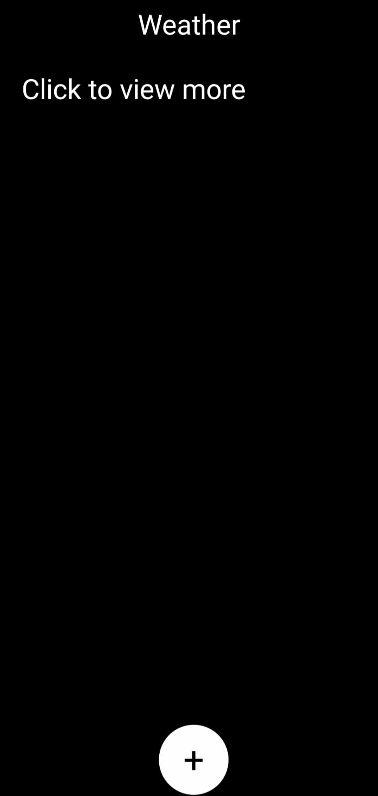
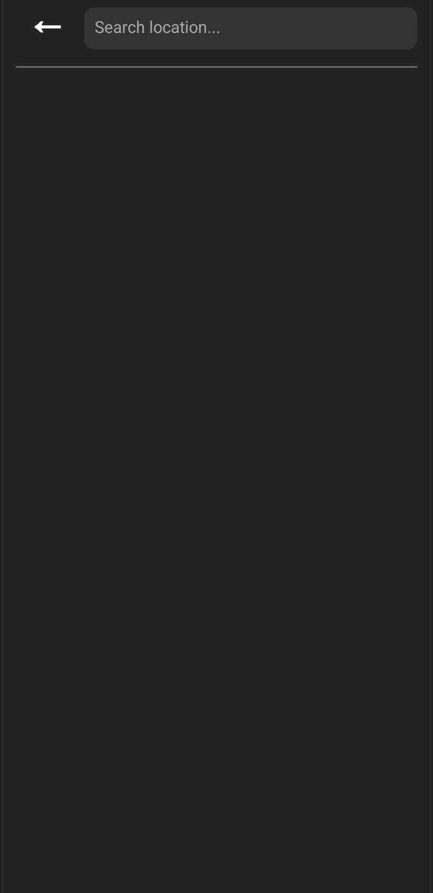
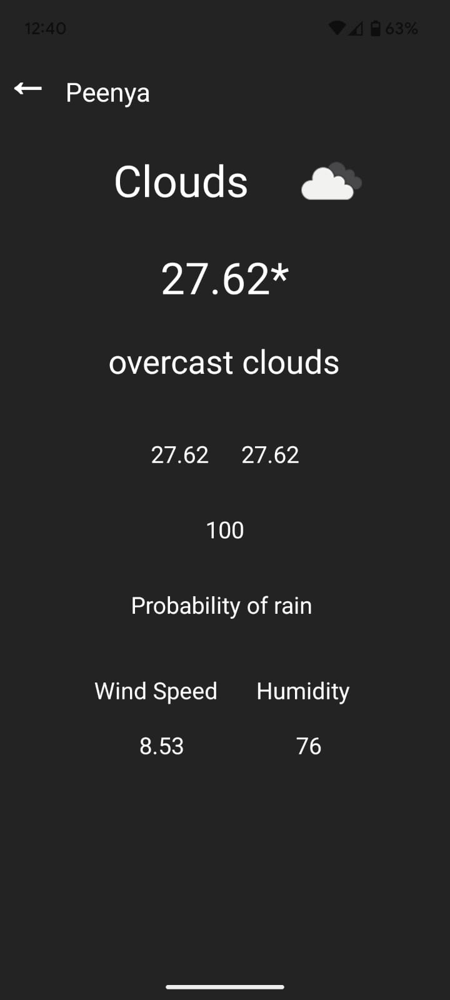

# 🌦️ Weather App — React Native

This is a simple weather-tracking app built with React Native using the OpenWeatherMap API. The app allows users to search for cities, view weather data, and explore detailed weather information with a clean UI.

---

## 📱 App Overview by Screens

---

### 🏠 Main Screen

**File:** `Main.js`

- Displays a list of added cities.
- Each city is represented as a weather card.
- Tapping a card navigates to the **CityDetails** screen.
- Floating "+" button at the bottom allows users to add more cities.

📷 **Screenshot:**

---

### ➕ Add City Screen

**File:** `Moredetails.js`

- Contains a back button and a search bar powered by autocomplete.
- Uses OpenWeatherMap's Geocoding API to suggest cities as you type.
- Selecting a city adds it to the tracked list and navigates back to Main.

📷 **Screenshot:**

---

### 🧾 City Details Screen

**File:** `CityDetails.js`

- Shows detailed weather info for a selected city:
  - Weather condition and icon
  - Current temperature
  - Description (e.g., "light rain")
  - Max/Min temperature
  - Cloudiness, wind speed, humidity, and probability of precipitation (pop)
- Includes a back button to return to Main.

📷 **Screenshot:**

---

### 📦 Location Card Component

**File:** `Location.js`

- A reusable card component used in Main.js.
- Fetches weather data for a given city name.
- Displays name, description, and temperature.
- On press, navigates to CityDetails with weather data passed as route params.

📷 **Screenshot (Card in Main):**

---

## 🔑 API Used

- OpenWeatherMap API for current weather
- OpenWeatherMap Geocoding API for autocomplete

---

