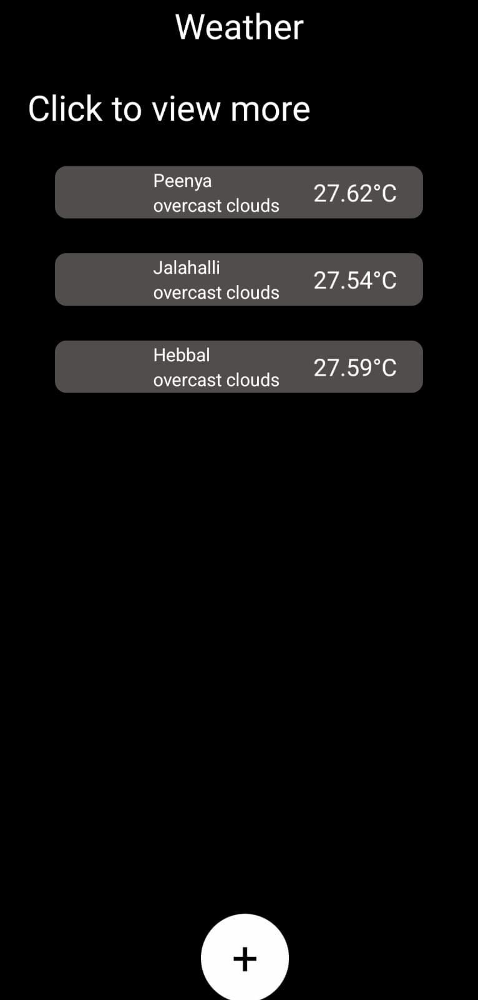

# 🌦️ Weather App — React Native

This is a simple weather-tracking app built with React Native using the OpenWeatherMap API. The app allows users to search for cities, view weather data, and explore detailed weather information with a clean UI.

---

## 📱 App Overview by Screens

---

### 🏠 Main Screen

**File:** `Main.js`

- Displays a list of added cities.
- Each city is represented as a weather card.
- Tapping a card navigates to the **CityDetails** screen.
- Floating "+" button at the bottom allows users to add more cities.

📷 **Screenshot:**


---

### ➕ Add City Screen

**File:** `Moredetails.js`

- Contains a back button and a search bar powered by autocomplete.
- Uses OpenWeatherMap's Geocoding API to suggest cities as you type.
- Selecting a city adds it to the tracked list and navigates back to Main.

📷 **Screenshot:**


---

### 🧾 City Details Screen

**File:** `CityDetails.js`

- Shows detailed weather info for a selected city:
  - Weather condition and icon
  - Current temperature
  - Description (e.g., "light rain")
  - Max/Min temperature
  - Cloudiness, wind speed, humidity, and probability of precipitation (pop)
- Includes a back button to return to Main.

📷 **Screenshot:**


---

### 📦 Location Card Component

**File:** `Location.js`

- A reusable card component used in Main.js.
- Fetches weather data for a given city name.
- Displays name, description, and temperature.
- On press, navigates to CityDetails with weather data passed as route params.

📷 **Screenshot (Card in Main):**



---

## 📁 Folder Structure

```
weather-app/
├── components/
│   └── WeatherCard.js
├── screens/
│   └── HomeScreen.js
├── assets/
│   └── icons/
│       ├── sun.png
│       ├── rain.png
│       └── cloud.png
├── App.js
├── README.md
└── package.json
```


## ⚙️ How It Works

- User enters a city name or grants location access.
- App fetches weather data using OpenWeatherMap API.
- JSON response is parsed and passed to the weather screen.
- UI dynamically updates to display current conditions.

## 🔧 Setup & Run Locally

1. Clone the repo  
   `git clone https://github.com/Hunter69240/weather-app.git`

2. Navigate to the folder  
   `cd weather-app`

3. Install dependencies  
   `npm install`

4. Run on emulator or device  
   `npx react-native run-android`  
   _or_  
   `npx expo start` (if using Expo)

## 🔑 API Used

- **OpenWeatherMap API**  
  [https://openweathermap.org/api](https://openweathermap.org/api)  
  > Get a free API key and add it where required in the app.

## 🙌 Credits

- Icons from [Icons8](https://icons8.com/)
- Weather data from [OpenWeatherMap](https://openweathermap.org/)
- Developed using React Native


